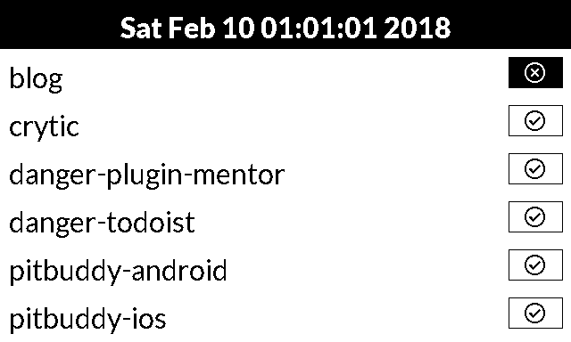

 

# E-Ink Build Dashboard

It's easy to loose the bigger picture of one's software projects. If you're addicted to test automation like I am,
you have CI builds set up for the projects you care about. However, they are scattered throughout travis, circleci,
bitrise and so on. So I needed to come up with an easy way to see build statuses for all of them at once, at a glance.
Things I needed:

* Raspberry Pi 3 Model B
* Waveshare 7.5in E-Ink Display
* Some python (this repository)

